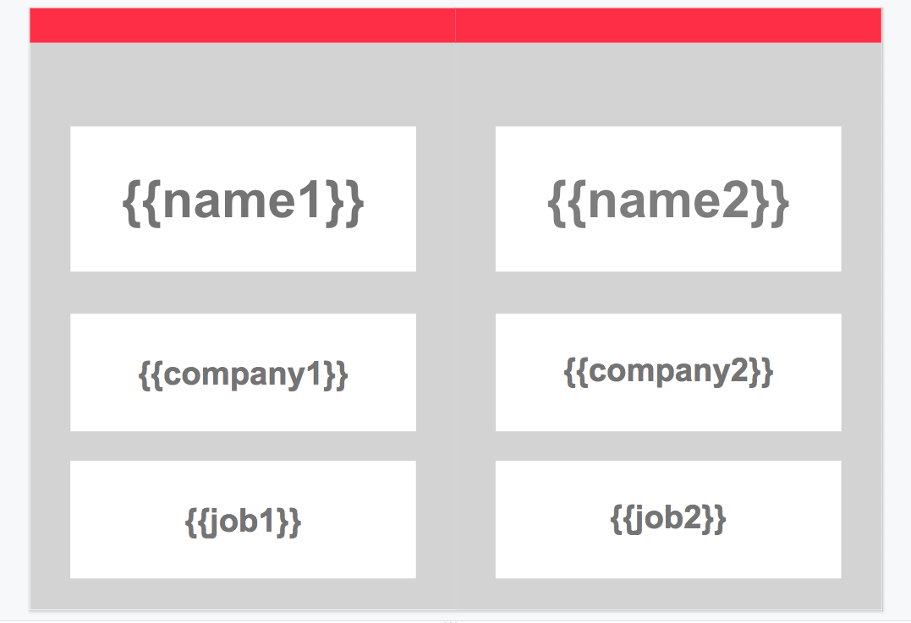
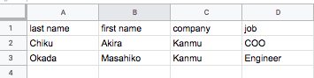

# nafd

Create name card from Google Sheet and Slide.

### Install

- Download this repo to local machine
- `yarn install`
- Install clasp
  * https://github.com/google/clasp
- Setup GAS function remote execution config
  * https://github.com/google/clasp#run

### Slide & Sheet

Create Google Slide like the following. Placeholders like `{{name1}}` are the places where data comes in.



Create Google Sheet filled with participants data. (Currently we support name, company job, but you can modify Slide, Sheet, and this code so that you can add your own fields.)



### Run

- Before actually running command, make sure you completed configuration
  * https://github.com/google/clasp#run


```
clasp run createNamePlates -p '["<sheet_id>", "<slide_id>"]'
```

This `<sheet_id>`, and `<slide_id>` are the value between the "/d/" and the "/edit" in the URL of your spreadsheet and slide.

```
https://docs.google.com/spreadsheets/d/spreadsheetId/edit#gid=0
```
